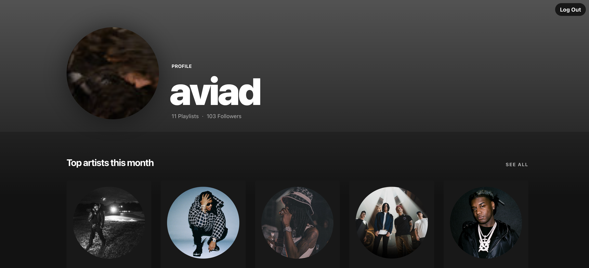
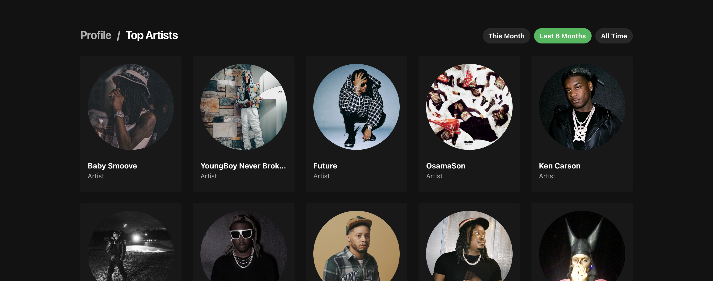
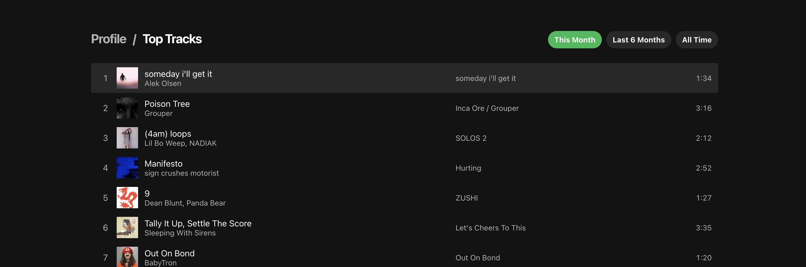
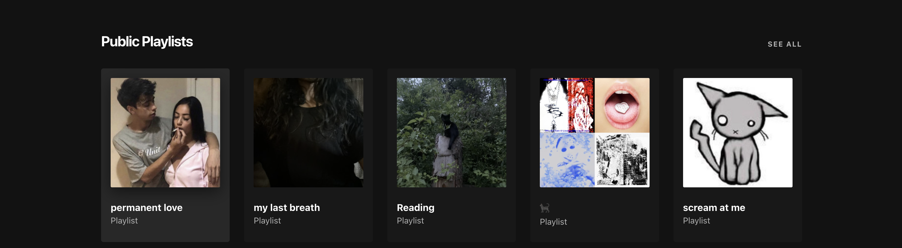
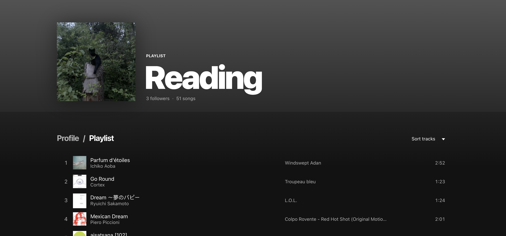

# Spotify Profile App

A React app that uses the Spotify API to display a user's top artists and tracks, and their recently played tracks.

## Build with
- HTML
- CSS
- JavaScript
- [Styled-Components](https://styled-components.com/)
- [React](https://reactjs.org/)
- [React Router](https://reactrouter.com/)
- [Node](https://nodejs.org/en/)
- [Express](https://expressjs.com/)

## Live Preview
[Spotify Profile App](https://aviad-spotify-profile-24b1df1946bf.herokuapp.com/)

## Preview







## Local Installation & Set Up

1. Register a Spotify App in your [Spotify Developer Dashboard](https://developer.spotify.com/dashboard/) and add `http://localhost:8888/callback` as a Redirect URI in the app settings

2. Create a `.env` file at the root of the project based on `.env.example` and add your unique `CLIENT_ID` and `CLIENT_SECRET` from the Spotify dashboard

3. Ensure [nvm](https://github.com/nvm-sh/nvm) and [npm](https://www.npmjs.com/) are installed globally

4. Install the correct version of Node

    ```shell
    nvm install
    ```

5. Install dependencies

    ```shell
    npm install
    ```

6. Run the React app on <http://localhost:3000> and the Node server on <http://localhost:8888>

    ```shell
    npm start
    ```